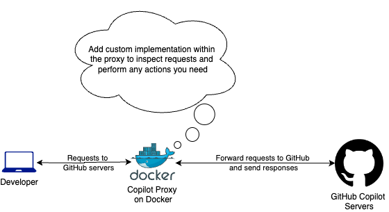
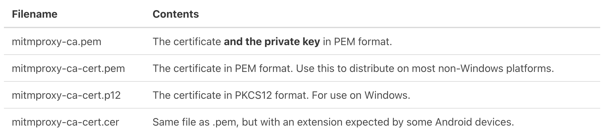

# copilot-proxy-server


This is a proxy service implementation for GitHub Copilot. This proxy helps you to intercept the requests sent by the developer (IDE) to GitHub servers so that you can,
- track the GitHub Copilot usage via the telemetry requests
- inspect requests and enforce security practices
- monitor the network usage

Below is the high-level solution architecture



You can add your custom implementation to intercept requests and perform any action on them using Python as mentioned below. 

The entire proxy server can be run as a Docker container.

> Read more about the network settings for Copilot Proxy from [here](https://docs.github.com/en/copilot/managing-copilot/configure-personal-settings/configuring-network-settings-for-github-copilot?tool=vscode)

## Solution Overview

This proxy service has been implemented using [mitmproxy](https://mitmproxy.org/). To use the proxy server, you need to install the GitHub Copilot extension and configure it first. By default, all Copilot related requests are pointed to the GitHub servers directly. To use the proxy, you need to update the `proxy_url` configuration to point to your proxy according to the IDE you use. See the guide [here.](https://docs.github.com/en/copilot/managing-copilot/configure-personal-settings/configuring-network-settings-for-github-copilot?tool=vscode)

This setup only gives you the ability the see the requests but not the actual payload of requests and responses due to SSL protection. To inspect request/response payloads, you need to use a custom certificate. By default, when you install `mitmproxy`, it saves the default certificates in the `~/.mitmproxy` folder meaning that it will use those certificates.



You need to ensure that the corresponding certificate (`mitmproxy-ca-cert.cer`/`mitmproxy-ca-cert.pem`) has been installed on the developers device so that the proxy is considered as a trusted entity.

## Sample Implementation

The sample implementation in this repository provides below features,
- Docker implementation
- Terraform infrastructure code to deploy the proxy on AWS ECS with auto-scaling
- Sample implementation to intercept requests and push Copilot accepted suggestions (`copilot/ghostText.accepted`) to a SQS queue

## Prerequisites

- AWS account and access to make deployments (ex. ECS/SQS)
- Terraform
- Docker

## How to Setup

- Create a directory called `certs` and add the certificates to be used in each run. You can first install `mitmproxy` locally and copy the created certificates in `~/.mitmproxy` folder to here. This is important to ensure all proxy instances are using the same certificates to validate requests.
- Customize the `main.py` file to implement your logic to intercept and act to Copilot events. The sample implement will push accepted suggestion events to a SQS queue. Update the `queue_url` to point to the queue you want to send events.
- Build the docker image with `docker build -t copilot-proxy-server --platform linux/amd64 .` (Update the platform parameter according to your use case)
- Run the docker image. Enable port `8080` since mitmproxy uses 8080 by default. Ensure to set the AWS credentials as env variables so that it can access SQS to put events.

```
docker run -it --rm -p 8080:8080 \
-e AWS_ACCESS_KEY_ID=<key_id> \
-e AWS_SECRET_ACCESS_KEY=<secret_key> \
-e AWS_DEFAULT_REGION=us-east-1 \
copilot-proxy-server
```

- Run `terraform apply -target=aws_ecr_repository.copilot_proxy_repo` to only create the ECR repo first.
- Push the image to the ECR (Use the ECR guidelines to tag and push the image)
- Run `terraform apply` to create rest of the resources
- You can access the proxy by the domain of the created NLB instance.
- Use that url to update the `proxy_url` in your IDE to use the proxy
